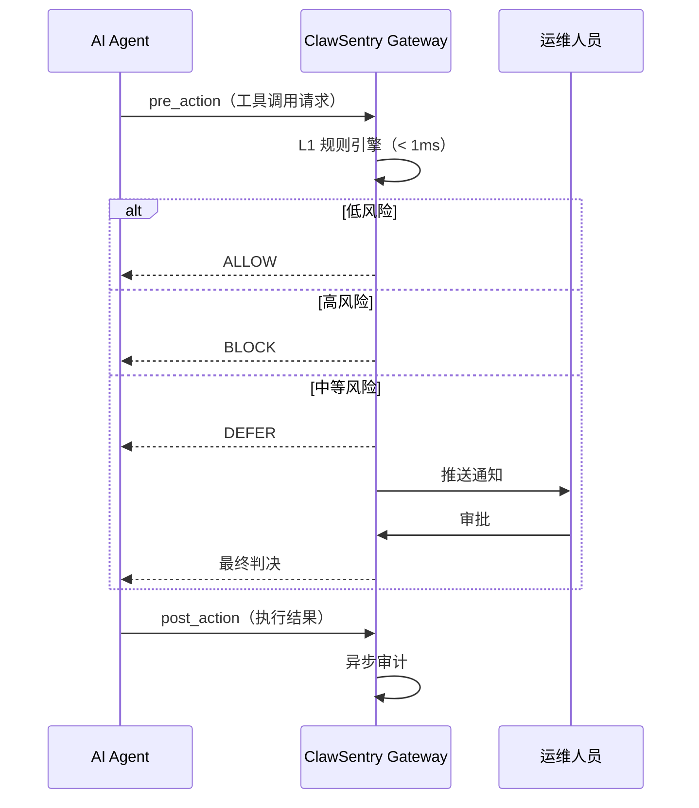

# 快速开始

只需 **3 条命令**，即可让 ClawSentry 守护你的 AI 编码助手。

## 选择你的框架

=== "Claude Code"

    ```bash
    pip install clawsentry                # 1. 安装
    clawsentry init claude-code           # 2. 初始化（自动注入 hooks）
    source .env.clawsentry && clawsentry gateway  # 3. 启动网关
    ```

    然后正常使用 `claude` 即可 — 所有工具调用自动经过安全评估。

=== "Codex CLI"

    ```bash
    pip install clawsentry                # 1. 安装
    clawsentry init codex                 # 2. 初始化
    source .env.clawsentry && clawsentry gateway  # 3. 启动网关
    ```

    Gateway 启动后，Codex 将工具调用事件发送到 `POST http://127.0.0.1:8080/ahp/codex`。

=== "a3s-code"

    ```bash
    pip install clawsentry                # 1. 安装
    clawsentry init a3s-code              # 2. 初始化
    source .env && clawsentry gateway     # 3. 启动网关
    ```

    在 a3s-code 配置中设置 Hook: `program = "clawsentry-harness"`。

=== "OpenClaw"

    ```bash
    pip install clawsentry                # 1. 安装
    clawsentry init openclaw --auto-detect --setup  # 2. 初始化
    source .env && clawsentry gateway     # 3. 启动网关
    ```

    Gateway 自动通过 WebSocket 连接 OpenClaw 并监听审批事件。

!!! success "就这么简单"
    安装 → 初始化 → 启动网关，三步完成。ClawSentry 会自动拦截高危操作（如 `rm -rf`），放行安全操作（如读取文件），中等风险操作交给你审批。

---

## 验证是否生效

启动 Gateway 后，在**另一个终端**打开实时监控：

```bash
clawsentry watch
```

然后正常使用你的 AI 编码助手。每当 Agent 调用工具时，你会看到实时决策输出：

```
──────────────────────────────────────────────────────────────
[14:23:05] DECISION  session=my-session
  verdict : ALLOW
  risk    : low
  command : cat README.md
  tier    : L1 (<1ms)
──────────────────────────────────────────────────────────────
[14:23:12] DECISION  session=my-session
  verdict : BLOCK
  risk    : high
  command : rm -rf /important-data
  tier    : L1 (<1ms)
  reason  : Destructive system command detected
──────────────────────────────────────────────────────────────
```

---

## 详细步骤

如果你想了解每一步做了什么，展开对应框架的完整流程：

### Claude Code {#claude-code}

??? note "Claude Code 完整流程（3 步）"

    **步骤 1: 初始化**

    ```bash
    cd your-project/
    clawsentry init claude-code
    ```

    这条命令会自动：

    - 生成 `.env.clawsentry` — 包含 UDS 路径和认证 Token
    - 注入 hooks 到 `~/.claude/settings.local.json` — 智能合并，不覆盖已有配置

    注入的 hooks 会让 Claude Code 在每次工具调用前自动请求 ClawSentry 审批：

    - `PreToolUse` — 阻塞等待决策（核心安全拦截）
    - `PostToolUse` / `SessionStart` / `SessionEnd` — 异步审计，不阻塞

    **步骤 2: 启动 Gateway**

    ```bash
    source .env.clawsentry
    clawsentry gateway
    ```

    **步骤 3: 正常使用 Claude Code**

    ```bash
    claude
    ```

    所有工具调用自动经过 ClawSentry 三层决策引擎评估。

    **卸载**

    ```bash
    clawsentry init claude-code --uninstall   # 移除 hooks，保留其他配置
    ```

### Codex CLI {#codex-cli}

??? note "Codex CLI 完整流程（3 步）"

    **步骤 1: 初始化**

    ```bash
    clawsentry init codex
    ```

    生成 `.env.clawsentry`，包含 HTTP 端口和认证 Token。

    **步骤 2: 启动 Gateway**

    ```bash
    source .env.clawsentry
    clawsentry gateway
    ```

    **步骤 3: 配置 Codex 调用端点**

    Codex 需要在工具调用前向 ClawSentry 发送 HTTP 请求：

    ```bash
    curl -X POST http://127.0.0.1:8080/ahp/codex \
      -H "Content-Type: application/json" \
      -H "Authorization: Bearer $CS_AUTH_TOKEN" \
      -d '{
        "event_type": "function_call",
        "session_id": "my-session",
        "payload": {
          "name": "shell",
          "arguments": {"command": "ls -la"}
        }
      }'
    ```

    响应示例：

    ```json
    {"result": {"action": "continue", "reason": "...", "risk_level": "low"}}
    ```

    `action` 为 `continue` 表示允许，`block` 表示阻止。

### a3s-code {#a3s-code}

??? note "a3s-code 完整流程（4 步）"

    **步骤 1: 初始化**

    ```bash
    clawsentry init a3s-code
    ```

    生成 `.env` 文件，包含 UDS 路径和认证令牌。

    **步骤 2: 加载环境变量**

    ```bash
    source .env
    ```

    **步骤 3: 配置 a3s-code Hook**

    在 a3s-code 配置中添加：

    ```hcl
    hooks {
      ahp {
        transport = "stdio"
        program   = "clawsentry-harness"
      }
    }
    ```

    **步骤 4: 启动 Gateway**

    ```bash
    clawsentry gateway
    ```

    然后正常运行 `a3s-code agent`，工具调用自动经过 ClawSentry 审查。

### OpenClaw {#openclaw}

??? note "OpenClaw 完整流程（3 步）"

    **前置条件**：OpenClaw Gateway 已运行（默认端口 `18789`）

    **步骤 1: 初始化（自动检测 + 自动设置）**

    ```bash
    clawsentry init openclaw --auto-detect --setup
    ```

    自动从 `~/.openclaw/openclaw.json` 读取配置，并设置 `tools.exec.host = "gateway"`。

    **步骤 2: 加载环境变量**

    ```bash
    source .env
    ```

    **步骤 3: 启动 Gateway**

    ```bash
    clawsentry gateway
    ```

    Gateway 自动通过 WebSocket 连接 OpenClaw，监听 `exec.approval.requested` 事件。

    使用交互式审批模式处理 DEFER 决策：

    ```bash
    clawsentry watch --interactive
    ```

---

## 一键启动（更简单）

不想分步操作？`clawsentry start` 一条命令搞定：

```bash
clawsentry start                              # 自动检测框架
clawsentry start --framework claude-code      # 指定框架
clawsentry start --interactive                # 启用 DEFER 交互式审批
```

该命令自动完成：初始化 → 加载环境变量 → 后台启动 Gateway → 前台显示实时监控。

按 `Ctrl+C` 优雅关闭。

---

## 到底发生了什么？

无论使用哪个框架，ClawSentry 在背后执行相同的安全监督流程：



1. **事件归一化** — 不同框架的事件格式被 Adapter 转换为统一格式
2. **风险评估** — L1 引擎在 1ms 内计算 D1-D6 六维风险评分
3. **决策生成** — ALLOW / BLOCK / DEFER
4. **结果回传** — 通过原通道返回给 Agent
5. **持久化** — 记录到 SQLite，供审计和回放

---

## 可选功能

### Web 仪表板

```bash
open http://127.0.0.1:8080/ui
```

提供实时决策流、会话雷达图、告警管理和 DEFER 审批面板。

### LLM 语义分析

默认仅使用 L1 规则引擎（无需 LLM，延迟 <1ms）。启用 L2/L3 深度分析：

```bash
pip install "clawsentry[llm]"
```

在 `.env.clawsentry` 中添加：

```ini
AHP_LLM_PROVIDER=anthropic
AHP_LLM_MODEL=claude-sonnet-4-20250514
ANTHROPIC_API_KEY=sk-ant-your-key-here
```

!!! note "L2/L3 仅在需要时触发"
    只有 L1 判定风险 ≥ medium 时才升级到 L2 语义分析。L3 审查 Agent 仅在 L2 无法确定时触发。

### 配置诊断

```bash
clawsentry doctor          # 12+ 项配置安全检查
clawsentry doctor --json   # 机器可读输出
```

---

## 下一步

- [核心概念](concepts.md) — 理解 AHP 协议和三层决策模型
- [常见问题](faq.md) — 常见疑问解答
- [Claude Code 集成](../integration/claude-code.md) — 完整配置参考
- [Codex CLI 集成](../integration/codex.md) — HTTP 端点详解
- [a3s-code 集成](../integration/a3s-code.md) — stdio Hook 详解
- [OpenClaw 集成](../integration/openclaw.md) — WebSocket 集成详解
